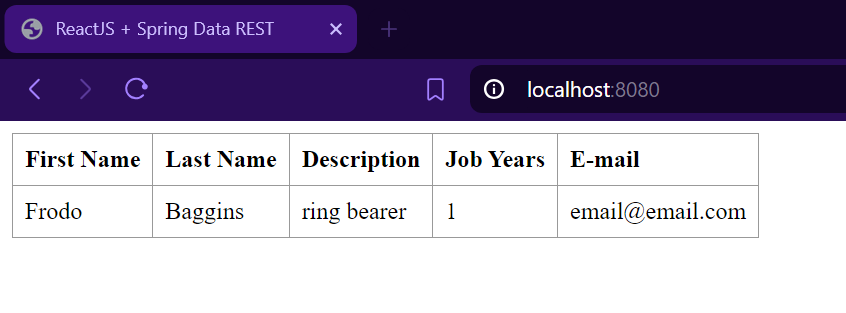

# Class Assignment 5 - CI/CD Pipelines with Jenkins

## Introduction

The goal of this assignment is to explore the use of Jenkins to create a CI/CD pipeline for a web application. By leveraging Jenkins, the process of building, testing, and deploying the application can be automated, ensuring consistency and reliability across different environments.

The first step of this assignment is to set up Jenkins.
To achieve this goal, the following steps were taken:
1. Download the Jenkins Windows file from the [Jenkins website](https://www.jenkins.io/download/)(at this time the latest
   version is 2.462).
2. Install the following Docker and HTML Publisher plugins in Jenkins:
   - Docker API
   - Docker Commons
   - Docker Pipeline
   - Docker
   - HTML Publisher
3. Create a new Jenkins job and configure it to use the GitHub repository. 
To do that, choose the "Pipeline" option, then select the
"Pipeline script from SCM", and set the SCM to Git, with the 
repository URL and the branch name, as well as the path to the Jenkinsfile.
4. Open a web browser and navigate to `http://localhost:8090` to access the Jenkins dashboard.

Jenkins is now set up and ready to create a CI/CD pipeline for the web application.

## Jenkinsfile - Part 1

After configuring the job and adding the GitHub repository link, 
we can proceed to create the Jenkinsfile. The Jenkinsfile defines the pipeline and outlines the 
steps it will execute. Below is the Jenkinsfile for the initial pipeline:

```groovy
pipeline {
   agent any

   stages {
      stage('Checkout') {
         steps {
            echo 'Checking out...'
            git branch: 'main', url: 'https://github.com/filipacardoso/devops-23-24-JPE-1231827.git'
         }
      }
      stage('Set Permissions') {
         steps {
            dir('CA2/part1') {
               echo 'Setting executable permissions on gradlew...'
               bat 'gradlew.bat'
            }
         }
      }
      stage('Assemble') {
         steps {
            dir('CA2/part1') {
               echo 'Assembling the application...'
               bat './gradlew.bat assemble'
            }
         }
      }
      stage('Test') {
         steps {
            dir('CA2/part1') {
               echo 'Running unit tests...'
               bat './gradlew.bat test'
            }
         }
      }
      stage('Archive') {
         steps {
            echo 'Archiving...'
            dir('CA2/part1') {
               archiveArtifacts 'build/libs/*.jar'
            }
         }
      }
   }
}
```


The Jenkinsfile defines a pipeline with the following stages: 
- The Checkout stage clones the repository from GitHub.
- The Set Permissions stage sets executable permissions on the Gradle wrapper script.
- The Assemble stage builds the application using Gradle.
- The Test stage runs the tests for the application.
- The Archive stage archives the build artifacts (JAR files) for later use.

After creating the pipeline, we can run it and check if it is working correctly.
The pipeline was successfully executed, resulting in the creation and archiving of the
artifact in the Jenkins workspace, as shown in the picture below:


## Jenkinsfile - Part 2


The second pipeline handles checking out, assembling, testing, creating an archive artifact, 
generating JavaDoc, and producing a Docker image for a Java project. This pipeline is divided 
into several stages. However, before these stages can run, it is necessary to set the environment variables for the Docker credentials ID, the Docker image, and the Docker tag.
Below is the Jenkinsfile for the second pipeline:

```groovy
pipeline {
   agent any

   environment {
      DOCKER_CREDENTIALS_ID = 'credentials-id'
      DOCKER_IMAGE = '1231827/ca5-part2'
      DOCKER_TAG = "${env.BUILD_ID}"
   }

   stages {
      stage('Checkout') {
         steps {
            echo 'Checking out the code...'
            git branch: 'main', url: 'https://github.com/filipacardoso/devops-23-24-JPE-1231827.git'
         }
      }

      stage('Set Permissions') {
         steps {
            dir('CA2/part2') {
               echo 'Setting executable permissions on gradlew...'
               bat 'gradlew.bat'
            }
         }
      }

      stage('Assemble') {
         steps {
            dir('CA2/part2') {
               echo 'Assembling the application...'
               bat './gradlew.bat assemble'
            }
         }
      }

      stage('Test') {
         steps {
            dir('CA2/part2') {
               echo 'Running unit tests...'
               bat './gradlew.bat test'
            }
         }
      }

      stage('Javadoc') {
         steps {
            dir('CA2/part2') {
               echo 'Generating Javadoc...'
               bat './gradlew.bat javadoc'
               publishHTML(target: [
                       allowMissing: false,
                       alwaysLinkToLastBuild: false,
                       keepAll: true,
                       reportDir: 'build/docs/javadoc',
                       reportFiles: 'index.html',
                       reportName: 'Javadoc'
               ])
            }
         }
      }

      stage('Archive') {
         steps {
            dir('CA2/part2') {
               echo 'Archiving artifacts...'
               archiveArtifacts artifacts: 'build/libs/*.jar', fingerprint: true
            }
         }
      }

      stage('Create Dockerfile') {
         steps {
            dir('CA2/part2') {
               script {
                  def dockerfileContent = """
                        FROM gradle:jdk21
                        WORKDIR /app
                        COPY build/libs/*.jar app.jar
                        EXPOSE 8080
                        ENTRYPOINT ["java", "-jar", "app.jar"]
                        """
                  writeFile file: 'Dockerfile', text: dockerfileContent
               }
            }
         }
      }

      stage('Publish Image') {
         steps {
            script {
               echo 'Building and publishing Docker image...'
               docker.withRegistry('https://index.docker.io/v1/', "${DOCKER_CREDENTIALS_ID}") {
                  dir('CA2/part2') {
                     def customImage = docker.build("${DOCKER_IMAGE}:${DOCKER_TAG}")
                     customImage.push()
                     customImage.push('latest')
                  }
               }
            }
         }
      }
   }
}
```

The Jenkinsfile defines a pipeline with the following stages:


1. **Checkout**
   - Checks out the code from the specified Git repository.

2. **Set Permissions**
   - Sets executable permissions on the `gradlew` script to ensure it can be run.

3. **Assemble**
   - Assembles the application using Gradle.

4. **Test**
   - Runs unit tests using Gradle.

5. **Javadoc**
   - Generates Javadoc documentation and publishes it as an HTML report.

6. **Archive**
   - Archives the build artifacts (JAR files) for later use.

7. **Create Dockerfile**
   - Creates a Dockerfile for the application, defining the base image and instructions for running the app.

8. **Publish Image**
   - Builds the Docker image and pushes it to Docker Hub.


To run this pipeline:

#### Open Jenkins Dashboard
Go to your Jenkins dashboard at `http://localhost:8090`.

#### Create a New Item

1. Click on "New Item" on the left menu.
2. Enter a name for your job (e.g., `MyDockerPipeline`).
3. Select "Pipeline" as the project type.
4. Click "OK".

#### Configure the Pipeline

1. In the job configuration page, scroll down to the "Pipeline" section.
2. Set "Definition" to "Pipeline script".
3. Copy and paste the provided Jenkinsfile script into the script box.

#### Save and Build

1. Click "Save" at the bottom of the job configuration page.
2. Click "Build Now" on the left menu to run the pipeline.

#### Monitor the Build

1. Click on the build number under "Build History" to see the console output and monitor the pipeline execution.

In this Jenkinsfile, the Docker image is pushed to Dockerhub. 
The pipeline was successfully executed, resulting in the creation of the 
Docker image published on the Docker Hub, as shown in the picture below:


To run the Docker image, it was necessary to pull the image from Docker Hub 
using the command `docker pull 1231827/ca5-part2:latest`.
Then, the image was run using the command `docker run -p 8080:8080 1231827/ca5-part2:latest`.
After running the image, the application could be accessed in a browser at the URL `http://localhost:8080`.


